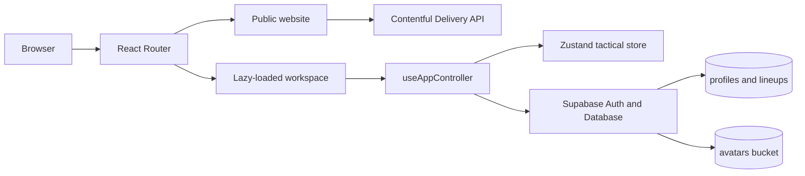

# Tài liệu kỹ thuật - Đội Hình Sân Cỏ

## 1. Tổng quan

**Đội Hình Sân Cỏ** là ứng dụng web tạo đội hình và mô phỏng chiến thuật bóng đá. Sản phẩm gồm hai khu vực chính:

- Website công khai: landing page, trang tính năng, giới thiệu và tin tức.
- Workspace: tạo đội hình sân 5/7/11/tùy chỉnh, vẽ sa bàn, tạo chuyển động, lưu và tải lại chiến thuật.

Ứng dụng là SPA viết bằng React, TypeScript và Vite. Các route công khai được prerender khi build để hỗ trợ SEO; workspace được lazy-load để giảm lượng JavaScript ban đầu cho landing page.

- Production: [doihinhsanco.pro.vn](https://doihinhsanco.pro.vn)
- Repository: [dylanaidev-hub/7-lineup](https://github.com/dylanaidev-hub/7-lineup)

## 2. Công nghệ

| Nhóm | Công nghệ | Vai trò |
| --- | --- | --- |
| UI | React 19, TypeScript | Component và type safety |
| Build | Vite | Dev server, bundling, code splitting |
| Routing | React Router DOM | Route và browser history |
| State | React hooks, Zustand | State UI và timeline chiến thuật |
| Animation | Framer Motion | Chuyển động marker giữa các bước |
| Backend | Supabase | Auth, database, avatar storage |
| CMS | Contentful | Tin tức, category, thumbnail và SEO |
| SEO | React Helmet Async, prerenderer | Meta tag và HTML prerender |
| Hosting | GitHub Pages | Static hosting và custom domain |
| Analytics | Google Analytics, Clarity | Traffic analytics và session insights |

CI và production build sử dụng Node.js 22.

## 3. Kiến trúc tổng thể



### Phân tách trách nhiệm

- `src/main.tsx`: khởi tạo provider và định nghĩa route cấp cao.
- `src/App.tsx`: entry của workspace, được tải bằng `React.lazy()`.
- `src/AppView.tsx`: render UI từ model của controller.
- `src/hooks/useAppController.ts`: composition root, kết nối các hook chuyên biệt.
- `src/stores/tacticalStore.ts`: Zustand store cho timeline và animation.
- `src/lineupState.ts`: data contract khi lưu lineup.
- `src/lineupRepository.ts`: thao tác ghi dữ liệu Supabase.
- CSS public page ưu tiên CSS Modules; workspace chia CSS theo miền chức năng trong `src/styles/`.

## 4. Routing và code splitting

### Route công khai

| Route | Nội dung |
| --- | --- |
| `/` | Landing page |
| `/tin-tuc` | Danh sách tin tức |
| `/tin-tuc/:slug` | Chi tiết bài viết |
| `/ve-chung-toi` | Về chúng tôi |
| `/tinh-nang/tao-doi-hinh` | Tính năng tạo đội hình |
| `/tinh-nang/ve-sa-ban` | Tính năng vẽ sa bàn |
| `/tinh-nang/tao-chuyen-dong` | Tính năng animation |

### Route ứng dụng

| Route | Nội dung |
| --- | --- |
| `/app/lineup?pitch=7` | Workspace đội hình |
| `/app/profile` | Hồ sơ người dùng |
| `/app/locker` | Chiến thuật đã lưu |

`/app/tactics` chỉ redirect về `/app/lineup`. URL legacy dùng `?tab=` vẫn được chuyển sang route mới.

Workspace được import động:

```ts
const CanvasApp = lazy(() => import("./App"));
```

Nhờ đó, người truy cập landing page không phải tải ngay toàn bộ code canvas.

## 5. Workspace đội hình

Workspace có ba chế độ:

- `LINEUP`: kéo thả cầu thủ, đối thủ và bóng.
- `CUSTOM`: vẽ đường hoặc mũi tên trên sân.
- `ANIMATION`: tạo các bước và phát chuyển động.

### State đội hình

`useUnifiedWorkspaceState` quản lý kích thước sân, formation, players, opponents và draw lines. State lưu vào database theo schema version `1`, được tạo bởi `serializeLineupState()`.

Tọa độ marker là tọa độ tương đối trên sân. Các module drag chính:

- `useMarkerDragSession`: pointer session dùng chung.
- `useLineupDragControls`: cập nhật player, opponent và ball.
- `pitchPointer.ts`, `pitchZones.ts`: chuyển pointer sang tọa độ sân.
- `DragPreview.tsx`: hiển thị marker trong lúc kéo.

### Vẽ sa bàn

`useDrawingControls` quản lý drawing, undo, redo và xóa nét. Đường vẽ được lưu cùng lineup và ghép vào ảnh khi export.

### Chuyển động

Mỗi `TacticalFrame` là snapshot vị trí của toàn bộ marker. Zustand store quản lý:

- `frames`: các bước đã chốt.
- `draftFrame`: bước đang chỉnh sửa.
- `playbackFrames`: snapshot riêng trong lúc phát.
- `currentFrameIndex`, `isPlaying`, `isLooping`.

Luồng chính:

1. Người dùng di chuyển marker trong `draftFrame`.
2. Bấm **Thêm bước** để clone snapshot vào `frames`.
3. `play()` chốt draft nếu có thay đổi và bắt đầu từ bước đầu.
4. `nextFrame()` chuyển đến bước tiếp theo.
5. Khi kết thúc, marker giữ tại bước cuối; loop sẽ quay lại bước đầu.

Framer Motion nội suy vị trí marker giữa các frame.

## 6. Authentication và Supabase

Supabase client nằm tại `src/lib/supabaseClient.ts`, chỉ được khởi tạo khi có:

- `VITE_SUPABASE_URL`
- `VITE_SUPABASE_ANON_KEY`

Không đưa secret hoặc service-role key vào frontend hay bất kỳ biến `VITE_*` nào.

`useAuth` quản lý session, auth state subscription, đăng xuất, password recovery và lỗi callback. UI hỗ trợ email/password, Google OAuth và quên mật khẩu.

### Database

Schema nguồn nằm tại `supabase/schema.sql`.

`profiles` lưu hồ sơ và liên kết với `auth.users`. Trigger `handle_new_user` tự động tạo profile khi user mới được tạo.

`lineups` gồm:

- `id`, `user_id`, `name`, `format`.
- `players_data`: JSONB chứa lineup hoặc tactical playbook.
- `created_at`.

RLS được bật cho `profiles` và `lineups`; user chỉ được đọc và ghi dữ liệu của mình. Avatar bucket cho phép public read, nhưng write/delete chỉ trong folder có tên bằng `auth.uid()`.

### Luồng lưu lineup

1. Tạo thumbnail và serialize workspace.
2. Upsert profile của user.
3. Insert record vào `lineups`.
4. `/app/locker` tải danh sách theo user.
5. Payload được kiểm tra bằng `isStoredLineupState()` trước khi restore.

Người chưa đăng nhập vẫn dùng được canvas, nhưng workspace không được persist local sau khi reload.

## 7. Contentful và SEO

Contentful cung cấp bài viết, category, rich text, thumbnail và SEO metadata. `useContentfulNews` cache dữ liệu trong memory và dùng fallback content khi request thất bại.

Production build chạy theo thứ tự:

1. `tsc -b`
2. `vite build`
3. `scripts/finalize-prerender.cjs`
4. `scripts/make-standalone.cjs`
5. `scripts/verify-prerender.cjs`

Route public được prerender. Workspace sử dụng `noindex,nofollow`.

## 8. Analytics

`index.html` hiện tải:

- Google Analytics: `G-NCQ98NW7LE`.
- Microsoft Clarity: `x9uydy476r`.

Hai script nằm trong `<head>` và áp dụng cho mọi route của SPA.

## 9. Biến môi trường

Tạo `.env.local` từ `.env.example`:

```env
VITE_SUPABASE_URL=https://your-project.supabase.co
VITE_SUPABASE_ANON_KEY=your-anon-key
VITE_CONTENTFUL_SPACE_ID=your-space-id
VITE_CONTENTFUL_ACCESS_TOKEN=your-content-delivery-api-token
VITE_CONTENTFUL_ENVIRONMENT=master
VITE_CONTENTFUL_CONTENT_TYPE=lineupFootball
```

Lưu ý:

- Development canvas có thể chạy khi thiếu Contentful.
- Production build bắt buộc có Contentful space ID và access token vì prerender cần lấy route bài viết.
- Supabase public config dùng GitHub Actions Variables.
- Contentful access token dùng GitHub Actions Secret.

## 10. Phát triển local

Yêu cầu Node.js 22 và npm.

```bash
npm ci
npm run dev -- --host 127.0.0.1 --port 5147
```

Kiểm tra code và build:

```bash
npx tsc -b
npm run build
```

Nếu build báo thiếu Contentful credentials, cần bổ sung biến môi trường thay vì bỏ qua prerender.

## 11. Deploy

Workflow nằm tại `.github/workflows/deploy.yml`.

Push vào `main` hoặc chạy `workflow_dispatch` sẽ:

1. Setup Node 22.
2. Chạy `npm ci`.
3. Build với Supabase và Contentful environment.
4. Upload thư mục `dist`.
5. Deploy lên GitHub Pages.

`public/CNAME` phải luôn chứa `doihinhsanco.pro.vn` để custom domain không bị mất sau build.

## 12. Cấu trúc thư mục

```text
src/
  main.tsx                     Router và bootstrap
  App.tsx                      Lazy entry của workspace
  AppView.tsx                  View tổng
  hooks/useAppController.ts    Composition root
  stores/tacticalStore.ts      Animation state
  hooks/                       Logic theo chức năng
  styles/                      CSS workspace
  lineupState.ts               Data contract
  lineupSerializer.ts          Serialize và validate
  lineupRepository.ts          Supabase write operations
supabase/schema.sql             Database, RLS, trigger, storage
scripts/                        Prerender và build verification
docs/                           Tài liệu dự án
public/CNAME                    Custom domain
```

## 13. Quy ước phát triển

- Không commit secret vào source.
- Không dùng Supabase service-role key trong browser.
- Khi thay đổi JSONB lineup, tăng version và thêm compatibility parser.
- Khi thêm route public, cập nhật router, prerender và SEO verification.
- Giữ tọa độ marker theo tỷ lệ sân để responsive không làm sai vị trí.
- Đặt state logic trong hook/store; component tập trung vào render và event wiring.
- Luôn xử lý error trả về từ Supabase SDK.

## 14. Giới hạn hiện tại

- Chưa có test runner và automated test trong `package.json`.
- Tactical store không persist local theo chủ đích sản phẩm.
- `players_data` linh hoạt nhưng cần versioning nghiêm túc khi schema mở rộng.
- RPC `email_auth_providers` cải thiện UX nhưng có trade-off user enumeration.
- Build local phụ thuộc Contentful credentials.
- Workspace CSS đang tiếp tục được tách nhỏ; hạn chế thêm selector global mới.

## 15. Checklist bàn giao

- [ ] `.env.local` đã được cấu hình.
- [ ] `supabase/schema.sql` đã chạy trên Supabase.
- [ ] Google provider và redirect URL đã được cấu hình.
- [ ] Contentful model đúng theo `docs/contentful-seo-fields.md`.
- [ ] GitHub Variables và Secrets đầy đủ.
- [ ] `npx tsc -b` thành công.
- [ ] `npm run build` thành công.
- [ ] GitHub Pages workflow thành công sau khi push `main`.
- [ ] `public/CNAME` vẫn giữ đúng custom domain.
- [ ] Landing, lineup, profile, locker và auth callback đã được smoke test.
